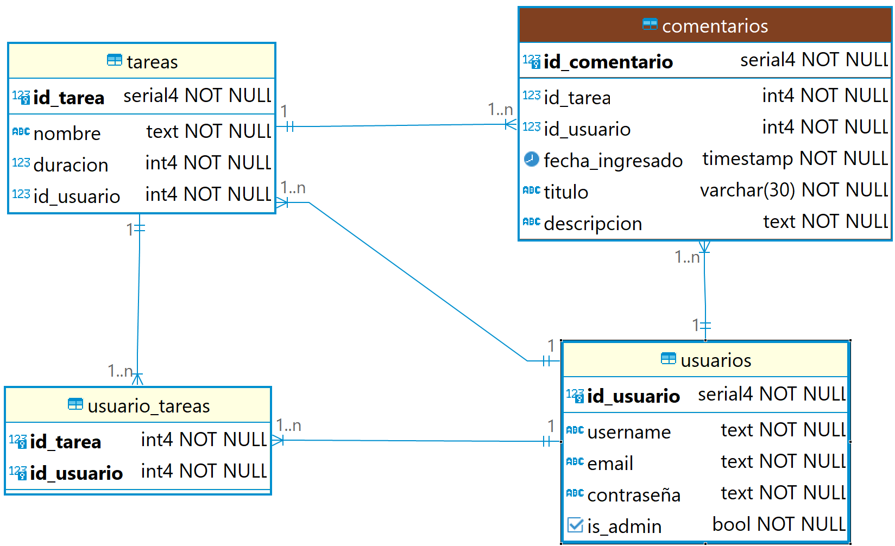

# PRIMER PARCIAL

#### Partimos de la siguiente base de datos:

### Para todas las rutas que ya aparecen en la documentación deben respetar las indicaciones de la descripción.

### Implementar las rutas, vistas y servicios necesarios para las siguientes historias de usuario:

### Para usuario no admin

- Como usuario quiero ingresar al sistema con mi usuario y contraseña.
- Como usuario quiero salir del sistema.
- Como usuario quiero ingresar un comentario en un tarea que tengo asignada.
- Como usuario quiero modificar un comentario de una tarea que tengo asignada.
- Como usuario quiero eliminar un comentario de una tarea que tengo asignada.
- Como usuario quiero ver los comentarios de las tareas que tengo asignadas.

### Para usuario admin

- Como administrador quiero ingresar al sistema con mi usuario y contraseña.
- Como administrador quiero salir del sistema.
- Como administrador quiero ingresar un comentario en un tarea.
- Como administrador quiero modificar un comentario de una tarea.
- Como administrador quiero eliminar un comentario de una tarea.
- Como administrador quiero ver los comentarios de las tareas.

- Como administrador quiero ver todas las tareas
- Como administrador quiero ver una tarea en particular
- Como administrador quiero modificar una tarea en particular
- Como administrador quiero borrar una tarea en particular.

- Como administrador quiero asignar un usuario a una tarea.
- Como administrador quiero desasignar un usuario a una tarea.

### Debes mantener los esquemas lo más planos posibles.

### Siempre debes usar los códigos de respuesta adecuados.

### Siempre debes diseñar las rutas con los principios rest en mente.

### Debes tener en cuenta de validar cuando corresponda:

- params
- body
- response

### No olvides implementar chequeos en el back para que:

- Un usuario no pueda comentar una tarea que ni tiene asignada ni es su creador.
- Un usuario no pueda modificar un comentario que no fue creado por el.
- Un usuario no pueda borrar un comentario que no fue creado por el.

### Al ingresar a / el sistema debe ser capaz de determinar si hay usuario logueado y si es administrador.

- Si no está logueado nos redirige al login.
- Si hay usuario logueado y es administrador, nos redirige a la lista de todas las tareas.
- Si hay usuario logueado y no es administrador, nos redirige a la lista de tareas asignadas al usuario.
- Cuando un usuario se loguea redirige a /.
